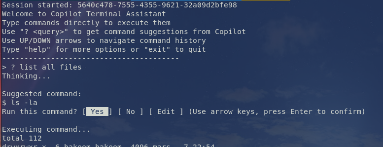

# Copilot Terminal

A command-line tool that uses GitHub Copilot to suggest terminal commands from natural language descriptions.

## Overview

Copilot Terminal bridges the gap between natural language and command-line interfaces. Simply describe what you want to do in plain English, and get the appropriate command.



## Features

- 🔑 GitHub authentication via device code flow
- 💾 Persistent storage of auth tokens
- 💬 Interactive REPL interface
- 🧠 Natural language to command translation
- 📜 Command history navigation with arrow keys
- 📝 Session context for smarter suggestions
- ⚡ Direct command execution mode
- 🤖 Powered by GitHub Copilot (Claude 3.5 Sonnet)

## Installation

```bash
npm install -g copilot-terminal
```

## Usage

```bash
# Start Copilot Terminal
copilot-terminal

# First time: authenticate with GitHub

# Direct command execution mode:
> ls -la
# Executes the command directly

# Command suggestion mode:
> ? show all docker containers including stopped ones
docker ps -a

> ? find all JavaScript files modified in the last week
find . -name "*.js" -mtime -7

# Command history navigation:
# Use UP/DOWN arrow keys to navigate through previous commands
# Use LEFT/RIGHT arrow keys to edit current command

# Built-in commands:
> help         # Show help message
> session      # Display session information
> clear        # Clear session history
> exit         # Exit the application
```

## Development

```bash
# Clone and setup
git clone <repository-url>
cd copilot-terminal
npm install

# Build and run
npm run build
npm start

# Development mode (build + run)
npm run dev
```

## Architecture

- **index.ts**: Entry point for authentication and REPL
- **auth.ts**: GitHub authentication using OAuth device flow
- **storage.ts**: Persistent token storage
- **session.ts**: Session management and history tracking
- **copilot.ts**: GitHub Copilot API integration with session context
- **repl.ts**: Interactive terminal interface with command history

## License

Apache License
